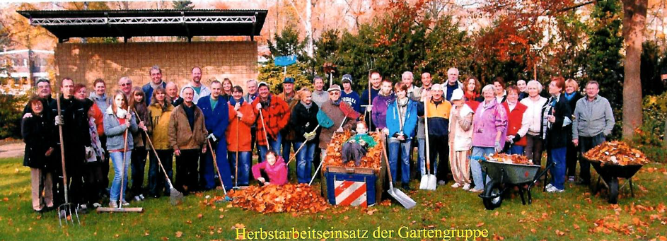

# Arbeitseinsatz SMH Gemeinden 2019

Am Samstag, den 09.11.2019 findet unser gemeinsamer Arbeitseinsatz der Berliner-SMH-Gemeinden mit der Gartengruppe statt. Wir beginnen um 10.00 Uhr mit einem Gebet in der Kirche.

* Hauptarbeit : „Blätterentsorgung“
* Jede helfende Hand ist für uns eine große Hilfe (auch wenn man spätere hinzukommt).
* Eigene Gartengeräte, wenn vorhanden, können ebenfalls mitgebracht werden (anderenfalls ist genug Werkzeug für alle da).
* Die Gartengruppe um Stephan Lehmann beginnt bereits ab 9 Uhr mit der Vorbereitung des Arbeitseinsatzes. Wer schon früher unterstützen möchte ist bereits am 9.00 Uhr herzlich willkommen.

