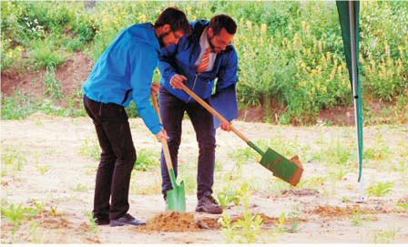

Den ersten Spatenstich für eine neue Kita in der Friedensstadt vollzogen am Mittwoch, dem 15. Juli, dem Geburtstag Schwester Josephines, Kirchenoberhaupt Stefan Tzschentke und sein Nachfolger Daniel Stolpe in der Siedlung des Meisters.
===   
  
## Im Herbst nächsten Jahres soll die KiTa ihre Arbeit aufnehmen können. 

„Das Haus, das hier errichtet wird, soll ein Haus der liebevollen Erziehung in die Freiheit Gottes sein und nicht ein Haus der Umerziehung in eine Gottesferne. Es soll den Menschen nützen und zum Himmel erziehen. Es soll ein Ort der Zuwendung, des Tröstens und des Freudeteilens werden und das schon während der Errichtung“, so Kirchenoberhaupt Stefan Tzschentke.

Den gesamten Bericht aus der aktuellen Weg und Ziel findet ihr [hier](20200721_Spatenstich_Kita.pdf).

  
## Worte des Kirchenoberhaupts zum Spatenstich

Worte von Kirchenoberhaupt Stefan Tzschentke zum Spatenstich der neuen Kindertagesstätte in der Friedensstadt Weißenberg am 15. Juli 2020 – dem Geburtstag von Schwester Josephine

Liebe Freunde, Gäste und Geschwister!

In der Schöpfungsgeschichte der Bibel hat Gott es uns vorgemacht: Er hat erschaffen und seine Arbeit verrichtet. Er hat geruht und sich freudig seine Werke angesehen. Er hat seine Menschen gottähnlich ausgerüstet und ihnen Kräfte verliehen, dass sie in seinem Sinne schaffen dürfen. So wollen wir hier die Kräfte nutzen und ihm zur Ehre ein Haus errichten.

Das Haus, das hier errichtet wird, soll ein Haus der liebevollen Erziehung in die Freiheit Gottes sein und nicht ein Haus der Umerziehung in eine Gottesferne. Es soll den Menschen nützen und zum Himmel erziehen. Es soll ein Ort der Zuwendung, des Tröstens und des Freudeteilens werden und das schon während der Errichtung. Jesus Christus spricht in den Evangelien der Heiligen Schrift:

„Lasset die Kinder und wehret ihnen nicht, zu mir zu kommen; denn solcher ist das Himmelreich.“ „Wer nicht das Reich Gottes annimmt wie ein Kind, der wird nicht hineinkommen.“

Joseph Weißenbergs Anliegen mit der Friedensstadt war und ist es, im praktischen Leben miteinander die Herzen der Menschen zu öffnen, damit der Himmel darin Platz findet. Denn ehe der Himmel zu den Menschen kommt, müssen zuvor die Herzen der Menschen Platz dafür geschaffen haben. Wenn wir in die Welt blicken, sehen wir vielerorts Krankheit, wirtschaftliche Nöte und Krieg. Kinder bedeuten aber Hoffnung auf Besserung. Sie sind Hoffnungsträger, so wie es Erwachsene auch sein können. Diese sind aber schon von dieser Erde geprägt und teilweise ihren Gesetzen unterworfen. Kinder hingegen sind freier und glaubens-, vertrauens- und phantasievoller als Erwachsene. Es ist wichtig, dass alle Planungen und Bautätigkeiten stets konzentriert, fröhlich und im liebevollen Respekt zueinander und gegenüber der Schöpfung gedacht und ausgeführt werden. Denken wir gut voneinander und der Geist Gottes kann uns begleiten und beflügeln. Gott ist der Baumeister, er steht über allem und ist Leiter und Auftraggeber. Wir dürfen alle seine Diener sein.

Wir beten zu unserem Herrgott:

Den Spaten, Herr, führ Deine Hand: Du sollst das Werk beginnen! Sonst wird es uns wie Staub und Sand durch unsere Hände rinnen. Es fließe Deines Geistes Strom in diesen Bau der Erde; viel Kraft aus Deinem ewgen Dom darin verankert werde. Herr, leg hinein, was nie zerfällt und frei bleibt von Bedauern, bau mit uns ein aus Deiner Welt den Glanz der Himmelmauern! Das Werk soll Dir zum Ruhm erstehn und allen rings zum Segen. Wer einst hier aus und ein wird gehen, der gehe Dir entgegen. Amen.

