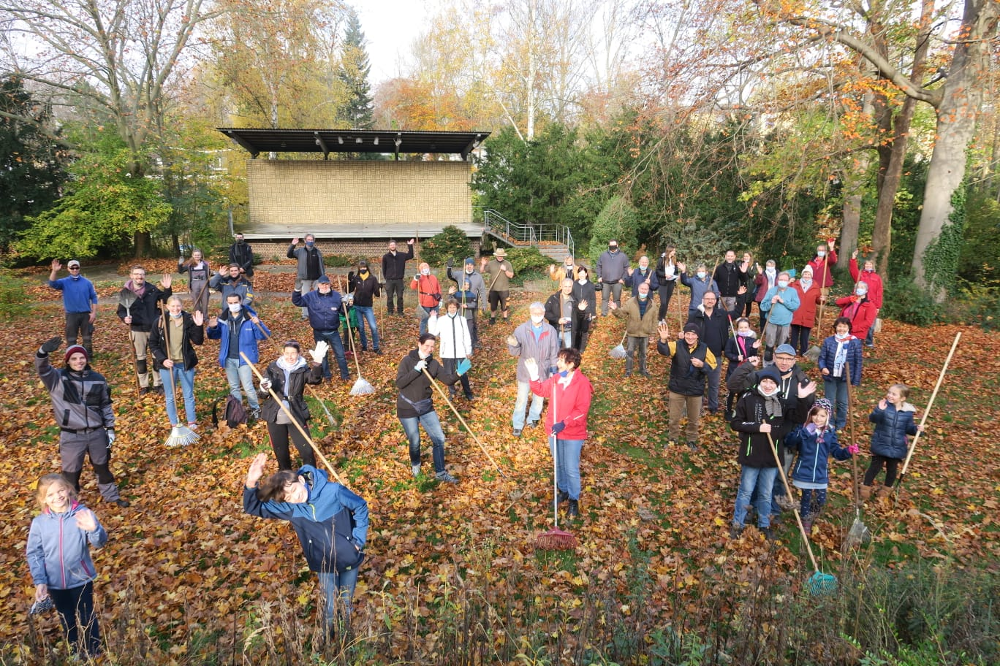

Liebe Geschwister und liebe Freunde,

mit dankbaren Herzen denken wir an unseren Herbstarbeitseinsatz am Samstag, den 7. November zurück. Wir bedanken uns herzlich bei unserem Lieben Gott für das wunderschöne Wetter, unfallfreies und vor allem fröhliches Arbeiten in großer Gemeinschaft.

Mit viel Abstand durften etwa 60 Helferinnen und Helfer von 0 bis 99 Jahren mit Maske und Abstand gemeinsam Laub harken. Besonders große Freude machte dabei der Besuch aus der Friedensstadt, der extra mit einem Laubsauger anreiste. Das erleichterte nicht nur, sondern beschleunigte auch die Arbeit sehr. Bereits zum gemeinsamem Mittagessen war ein Großteil der Arbeit erledigt. Auch bei allen Helferinnen und Helfern bedanken wir uns herzlich und freuen uns schon sehr auf die nächste Gelegenheit, mit euch zusammen in froher Gemeinschaft zu schaffen.  
Eure Gemeindeleitungen im SMH

(Fröhliche Arbeitsgemeinschaft am 7.11.2020. Foto: Anne-Julia Schäfer)

(Laubsauger im Einsatz im SMH am 7.11.2020. Video: Alexander Zachrau)