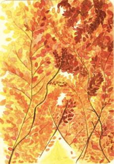

Ich hab den Herbst nicht so richtig wahrgenommen, immerhin findet der nur vor meinem Fenster statt und da kann ich nicht sooft rausgucken, weil meine Augen auf einem Bildschirm kleben. Meistens sehe ich auf dem Bildschirm niemanden, sondern höre nur eine Stimme aus dem Off, die mir Informationen über Sozialmanagement und Beratungskompetenzen gibt. Das Leid der Studierenden und vieler anderer in diesen Tagen.

Aber auch eine Zeit des Kennenlernens. Ich lerne mich kennen. Stehe vor der Herausforderung, mich mit mir selbst zu beschäftigen, meinen Tag selbst zu strukturieren und mich selbst als moralische Instanz zu definieren, inwiefern ich in dieser Situation mit meinen Mitmenschen umgehe. Ich lerne mich kennen als Menschen, der seine Freunde wirklich schmerzlich vermisst, der Sehnsucht empfindet nach einem freundlichen Gesicht und einer Umarmung, die vorher so leicht verfügbar war. Ich habe von einigen Menschen gehört, sie hätten sich während der Online Gottesdienste oder den Telefonübertragungen sehr einsam gefühlt. Das tut mir wirklich sehr leid, denn ich habe es als eine Vernetzung im wortwörtlichen Sinne empfunden. Als würden von mir aus viele dünne Lichtfäden zur Kirche gehen und zu all meinen Lieben und sie alle miteinander verbinden. Ich wiederum habe andere Lichtfäden zurückbekommen und fühlte mich gehalten. 

Und immer wieder, wenn ich denke, ich kann das nicht mehr, die Anforderungen sind zu groß, die Einschränkungen zu schwer, ich schmeiß lieber gleich alles hin und bleib in meinem Schlafanzug, denke ich daran, ich kann nicht tiefer fallen als in Gottes Hand. Ich empfinde das als sehr tröstlich und vielleicht erinnert sich jetzt jemand wieder daran, wie sehr uns Gott trösten kann.

Ich war nun also seit Wochen alleine Zuhause, hörte diese Stimmen, die mir den Studieninhalt vermitteln, versuchte morgens trotzdem etwas anderes als meinen Schlafanzug anzuziehen und stellte mich draußen hin. Ich sah, dass die Blätter bunt waren und die Bäume ganz kahl, dass es kalt geworden war und offensichtlich Herbst. Ich hielt mein Gesicht in die vereinzelten Sonnenstrahlen und fragte: "Du wachst über mich, oder?", während mir ein plötzlicher Wind die Haare zerzauste.

Ich denke, das war ein Ja.

 (Bild: Jona Rößler)