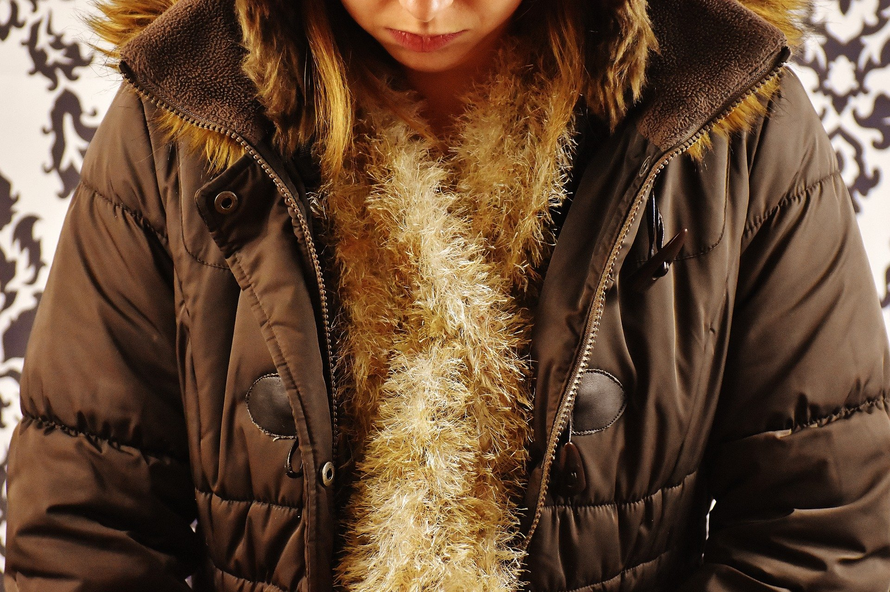

**Hier die wichtigsten Informationen auf einen Blick:**
 
* wir wollen mit dieser Spende an die Kultur im Hause Mendelssohn anknüpfen, die unser Oberhaupt Frieda Müller vor vielen Jahren zu unserem Weihnachtsmarkt inspirierte
* Dieser Aufruf unter dem Motto "an andere denken - Wärme schenken" richtet sich aus Ressourcengründen und aufgrund der Kurzfristigkeit nur an die SMH-Gemeinden, Mitgliedern anderer Gemeinden mit Spendenwunsch stehe ich gern beratend zur Seite, um regional etwas zu finden
* wir sammeln saubere und gut erhaltende Winterkleidung - Winterjacken und -mäntel, warme Pullover und Stiefel für Damen, Herren und Kinder, um sie über eine seriöse gemeinnützige Organisation Menschen in Armenien oder der Ukraine zukommen zu lassen, die, auch kriegsbedingt, von Armut und Not betroffen sind (gut erhalten sind solche Sachen, die die Menschen auch Dir und mir schenken würden)
* wir nehmen die Spenden gern am zweiten Advent vor und nach dem Gottesdienst im SMH persönlich entgegen (bitte keine Tüten oder Säcke in der Rezeption abgeben!), sortieren sie in Kartons und bringen sie zur Sammelstelle
* Für diejenigen, die traurig sind, dass sie sich nicht so kurzfristig beteiligen können: auch in Berlin gibt es Adressen, die sich über gut erhaltene Spenden freuen, um sie Bedürftigen günstig oder kostenfrei zukommen zu lassen oder gemeinnützige Einrichtungen mit den Einnahmen aus dem Verkauf unterstützen. Gerne geben wir Orientierung, srecht uns dann einfach an.
===

**Hier der vollständige Aufruf:**

Liebe Geschwister und Freunde,

da in diesem Jahr unser Weihnachtsmarkt ausfällt, möchten wir einmal an die Anfänge unseres Weihnachtsmarktes erinnern.

Immer in der Weihnachtszeit, versammelte sich hier im Mendelsohn Palais die Familie Mendelsohn und packte Päckchen für Menschen, die Hilfe gebrauchen konnten. Auch die Kinder machten mit und wurden so erzogen, sich zu diesem Anlass sogar von einem liebsten Spielzeug zu trennen und zu schenken. Von diesem Tun inspiriert, fasste damals unser Oberhaupt Frieda Müller den Entschluss einen Weihnachtsmarkt durchzuführen. Die Frauengruppen und die Nähstube bastelten oder buken, die Männer ebenso. Über die Jahre entwickelte sich unser Weihnachtsmarkt. Nun können wir in diesem Jahr kei- nen Weihnachtsmarkt durchführen. Doch riefen uns schon im August die Geistfreunde dazu auf zu teilen. Wörtlich sagten sie:

> „Ihr werdet hauptsächlich geprüft, wie ihr euch gegeneinander verhaltet, ob es zu einem wahren Miteinander kommt, ob das Wort: „Was du leichter kannst entbeh- ren: Hilf dem Bedrängten überall!“ wirklich bei euch trägt oder ob ihr noch arbei- ten müsst, dass ihr in die Nähe des Herrn kommt, des Herrn und Heilands.“ (Geistfreundrede, 30. August 2020, Seite 3.)

In diesem Gedanken möchten wir Euch heute dazu aufrufen, in Euren Kleiderschrank zu gucken und zu überlegen, ob ihr von dem, was ihr habt, etwas entbehren könnt. Wir sammeln, gut erhaltene Winterkleidung für Menschen in Armenien, die gerade in diesen Zeiten von Not und Armut betroffen sind und oft keine ausreichende Winterkleidung haben.

<b>An Andere denken – Wärme schenken!
</b>

Unter diesem Motto sammeln wir am zweiten Advent hier im St. Michaels Heim Winter- jacken, Mäntel, warme Pullover, Jacken und Stiefel und bringen sie dorthin, wo sie ge- braucht werden. Bringt das, was ihr geben und verschenken könnt einfach zum nächsten Gottesdienst mit. Es wird gesegnet sein. Für Fragen stehen Euch Andreas Schmetzstorff und Verena Wittke zur Verfügung.

Wir danken Euch im Voraus und wünschen Euch eine gesegnete Zeit.