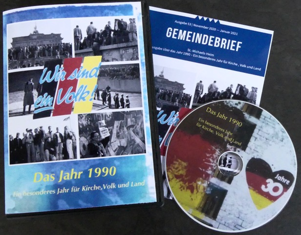

Der neue Gemeindebrief für alle Gemeinden im St.-Michaels-Heim ist da! Alle Geschwister und Freunde, die schon beim letzten digitalen Gemeiondebrief in den Verteiler aufgenommen werden wollen, haben diesen schon digital erhalten. Selbstverständlich gibt es den Gemeindebrief auch als gedrucktes Heft.
  

**Gemeindebrief online beziehen:**
* Wer zukünftig den Gemeindebrief immer online erhalten möchte, teilt dies bitte mit einer Mail an die [Kontaktadresse](https://smh-gemeinden.de/kontakt) mit. Ihr werdet dann in den Gemeindebriefmailverteiler aufgenommen.
* Wenn ihr den aktuellen Gemeindebrief nicht bekommen habt und nur diesen digital erhalten möchtet, schreibt dies bitte ebenfalls an die [Kontaktadresse](https://smh-gemeinden.de/kontakt). Bitte teilt dort auch mit, wenn ihr mit in euren Gemeindemailverteiler aufgenommen werden möchtet, über den auch regelmäßig wichtige Informationen verteilt werden.
* Auch Geschwister und Glaubensfreunde aus anderen Gemeinden können den Gemeindebrief erhalten. Diese lassen sich bitte ebenfalls über die [Kontaktadresse](https://smh-gemeinden.de/kontakt) in den Gemeindebriefmailverteiler aufnehmen.

 Der aktuelle Gemeindebrief kann auch [hier](Gemeindebrief%2053_Digital.pdf) heruntergeladen werden. 

|  |  |
| ------ | ----------- |
| .     . | [Formular 100 Aktionen für 100 Jahre Friedensstadt.pdf](Gemeindebrief%2053_Digital.pdf) |
  

**Gemeindebrief als gedrucktes Heft erhalten:**
* Der Gemeindebrief kann im St.-Michaels-Heim am Ewigkeitssonntag bezogen werden.
* Der Gemeindebrief kann auch im Anschluss an die folgenden Präsenzgottesdienste im Gemeindehaus erworben werden.
* Sollte keine der Optionen für dich möglich sein, wende dich bitte an deine Gemeindeleitung. Solltest du keine Kontaktdaten haben, nutze einfach die [Kontaktadresse](https://smh-gemeinden.de/kontakt).
  

**Zur Ausgabe:** 
Vor wenigen Wochen feierte Deutschland am 3. Oktober 2020 den 30. Jahres-Tag der Deutschen Einheit. 
Ein Tag, der auch für die Johannische Kirche von großer Bedeutung war. Prediger Rainer Gerhardt
hat in drei Vortrags-Folgen in Weg und Ziel einen Rückblick auf das bedeutsame Jahr 1990 geworfen und
die Weltereignisse mit den parallelen Ereignissen in unserer Kirche und ihren Verkündigungen verknüpft. Die Redaktion der Berliner SMH-Gemeinden hat diesen Vortrag, auch wegen seiner kirchengeschichtlichen Bedeutung für unsere Nachwelt, als Broschüre zusammengefaßt. Jeder, der die damalige Zeit miterlebt hat, wird  Erinnerungen daran haben, deshalb ist es gut, wenn diese Zusammenfassung in einer Broschüre gegen das Vergessen arbeitet. Auf z.T. bebilderten 20 Seiten kann jeder den Vortrag „Das Jahr 1990“ nachlesen.
  

**Bundle mit DVD dieser Ausgabe:** 
Um diese Erinnerungen an das Jahr 1990 nachhaltig zu fördern, hat die Gemeindebrief-Redaktion eine DVD mit einem farbigen Filmbericht von Hans Müller erstellt, in welchem vom Kirchentag 1990 bis zum Erntedankfest 1990 auf Gut Schönhof, die Freude und Dankbarkeit aus dem Kommentar von Siegfried Philipp spricht. Prediger Lothar Knitter hat in diesem Film mit deutlichen Worten die Einheit der Johannischen Kirche Ost und West verkündet. Ein bewegendes Dokument in diesem Film, in welchem viele Namen wieder Gesichter bekommen.
Diese DVD gibt es mit einem eingelegten 20-seitigen Bundle, der inhaltliche Gemeindebrief, in einer Kassette. Wer das Bundle mit DVD erhalten möchte, kann sich an Armin Mattstedt wenden.

Kontaktdaten:
* E-Mail: armin@mattstedt.de oder
* Telefon: 0307113999

(Bild zum Bundle: Gemeindebrief-Redaktion)