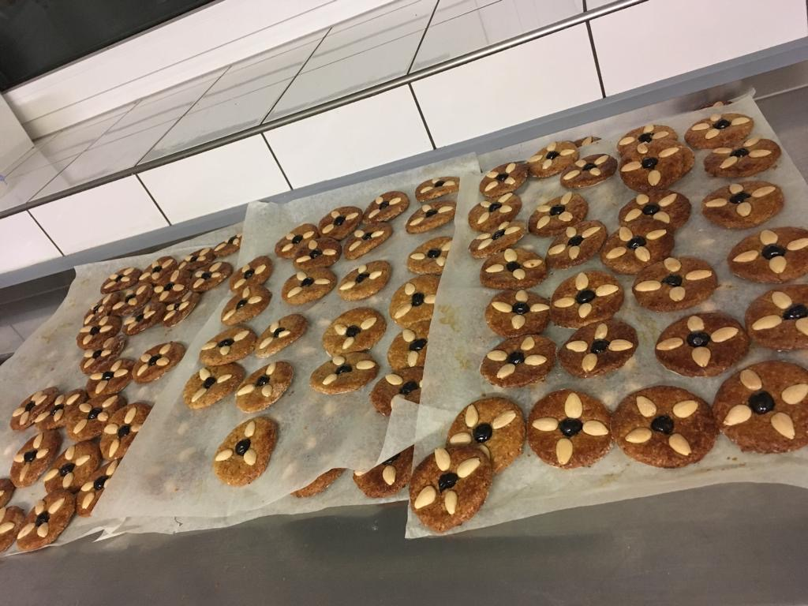

Wie jedes Jahr fangen wir wieder an
kaufen Mehl, Eier und Marzipan,
Vanillezucker, Schokolade,
und nicht zu vergessen: die Marmelade! Zuckerstreusel und Haferflocken,
Cointreau und Butter, sonst wird ́s zu trocken!
Dann wird geknetet, gerührt und gewogen der fertige Teig zu Kipferl verbogen....

**Na? Lust bekommen mitzumachen?**
Dann schließ Dich uns gerne ab dem 8. Oktober an; am besten mit eigener Küchenschürze und viel Elan. Du findest uns dann immer **dienstags** und **donnerstags ab 19 Uhr in der kalten Küche im Untergeschoss des St.-Michaels-Heims**. Gerne kannst Du uns auch schon **ab 18 Uhr** bei den Vorbereitungen helfen.
Wir freuen und auf Dich!

Infotelefon, auch für die Daheimbäcker: 030/ 49 20 67 50
**Alle Termine** inklusive Plan, welche Kekse gebacken werden, **findet ihr auch im Bereich Veranstaltungen**.

**Terminplanung**
* Di,	08.10.	Lebkuchen und Krippen
* Do,	10.10.	Pfeffernüsse und Lebkuchen mit Oblaten
* Di,	22.10.	Butterplätzchen, Walnussplätzchen und Mandarinenmonde
* Do,	24.10.	Schokomürbchen und Mandelmürbchen
* D i,	29.10.	Sahne-Nussplätzchen und Ingwerherzen
* Do,	31.10.	Marillenringe
* Di,	05.11.	Engelsaugen Dinkelkekse
* Do,	07.11.	Zimtsterne und evtl. Makronen
* Di,	12.11.	Deko-Tag
* Do, 14.11.	Zitronentaler Orangensterne mit Vollkorn?
* Di, 19.11.	Florentiner
* Do, 21.11.	Mandelsterne und Vanillekipferl

