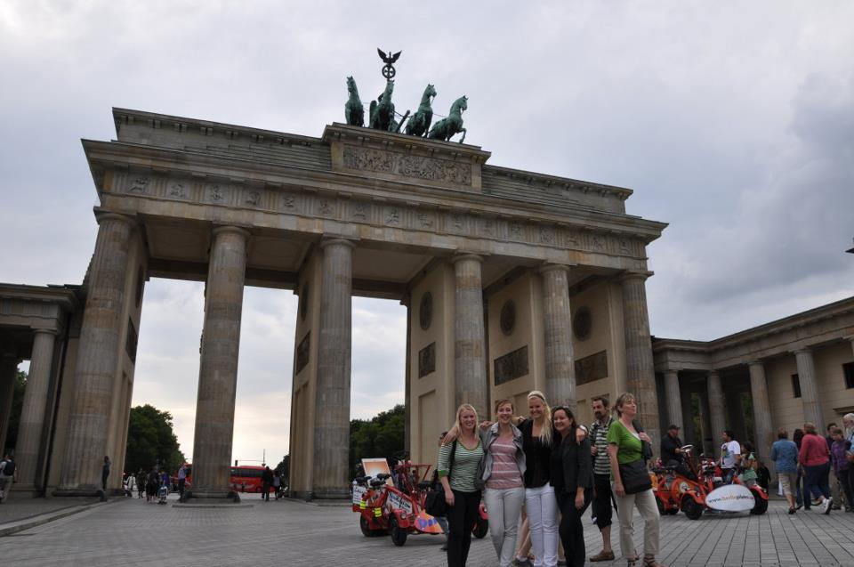

# In einem Bericht der PNN, wird über die Wiedereröffnung verschiedener Einrichtungen unter der Auflage von neuen Regeln berichtet. Darunter auch der Volkspark.===

Laut Bericht habe der kommunale Betreiber des Volksparks im Bornstedter Felds mittgeteilt, dass Sport- und Sanitäranlagen ab heute wiedereröffnen. Ab Samstag werde der Wasserspielplatz der mit diversen neuen Geräten ausgestatten worden sei freigegeben, jedoch „ohne kühles Nass“ bis zu Beginn der Badesaison Mitte Juli. „Aber auch hier gilt wie bei der Nutzung der Spielplätze, dass die geltenden Abstands-, Hygiene- und Kontaktregeln einzuhalten sind“, ginge aus der Mitteilung des Betreibers hervor. Weiter seien Kontrollen, für die Einhaltung der Regeln als auch für den Parkeintritt, angekündigt worden. Außerdem eröffne die Stadtverwaltung den Bürgerservice am Montag. Am Donnerstag habe bereits das Filmmuseum Dauerausstellung „Traumfabrik. 100 Jahre Film in Babelsberg“ wieder geöffnet, heißt es. 

Im Krisentagebuch der PNN, berichtet Anne Braun über ihre Erfahrungen während der Coronakrise. Die 34-jährige Grafikdesignerin habe ein Büro im Rechenzentrum, heißt es. Ihre fehle „die längerfristige Planung freiwilliger Projekte und Aktivitäten mit anderen Kreativen zum Beispiel im Rechenzentrum.“ Ihr Arbeitspensum sei in den ersten Wochen der Krise wesentlich höher gewesen, berichtet Braun. Auf der einen Seite seien einige Aufträge auf Eis gelegt worden. Andererseits habe sie dafür neue Projekte umgesetzt können.

Und hier der [Link](https://smh-gemeinden.de/news)